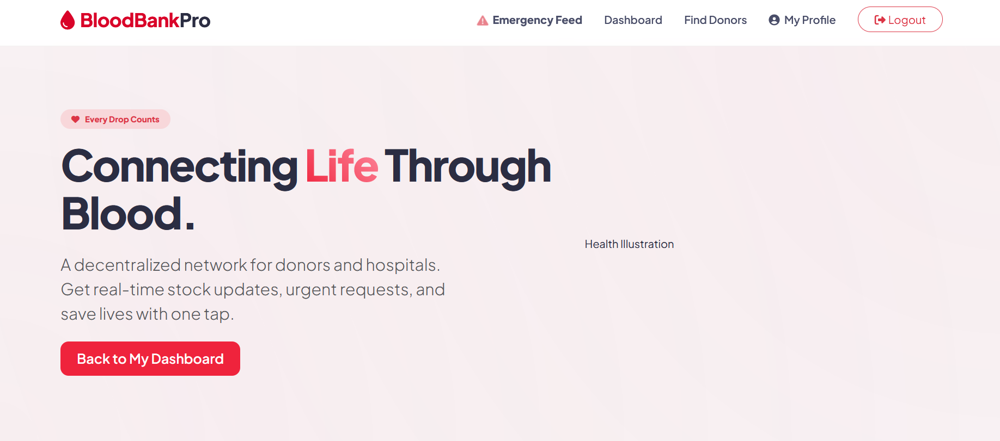
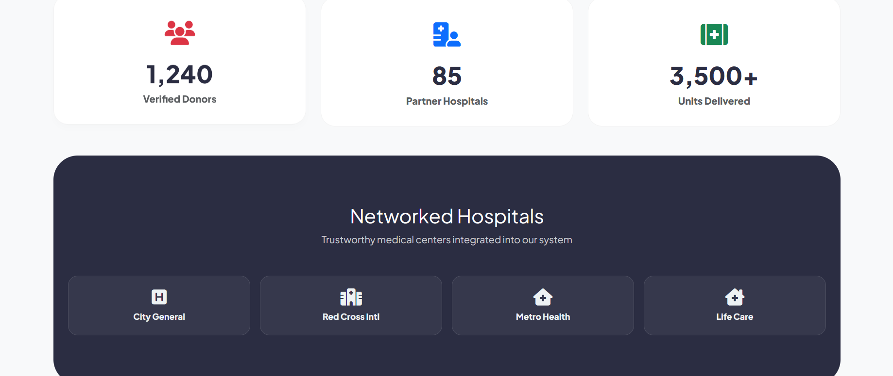
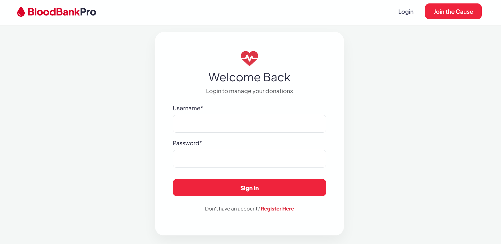
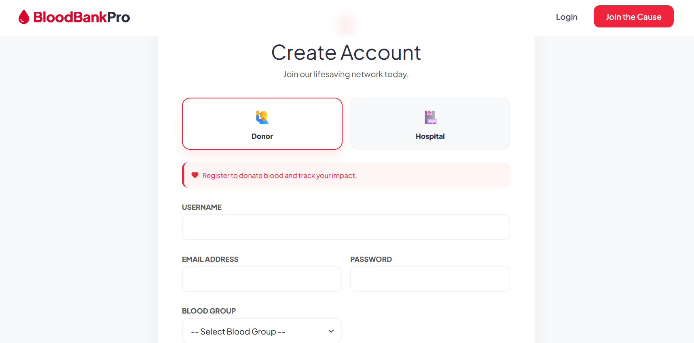
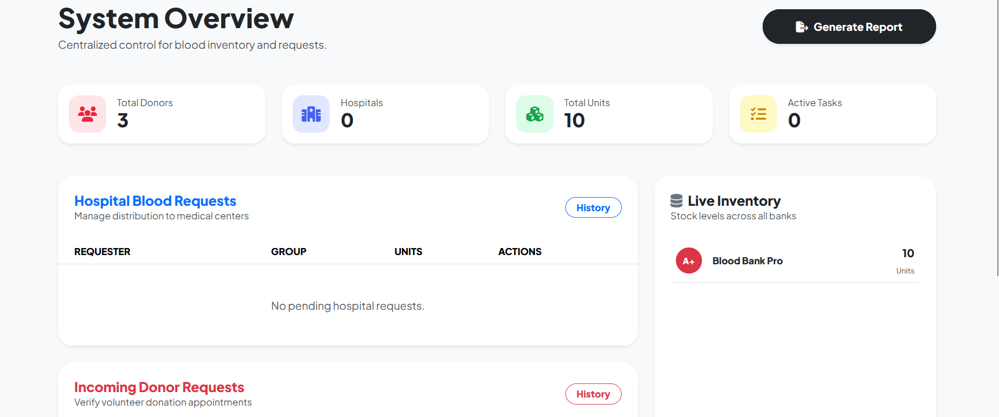
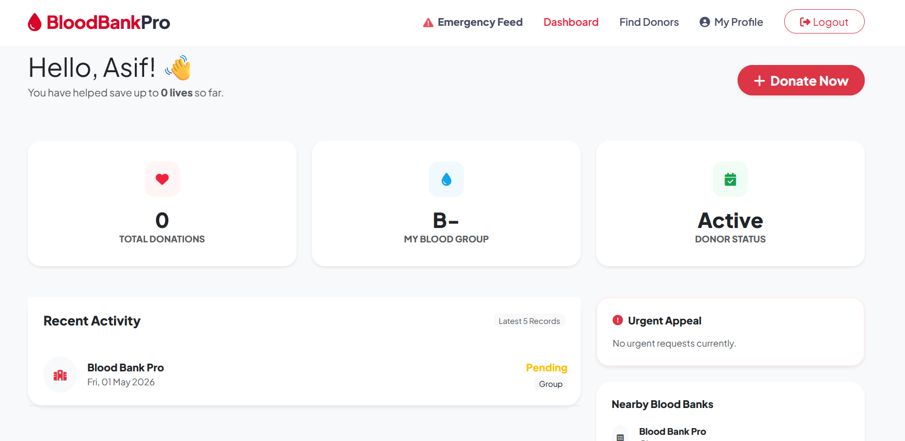
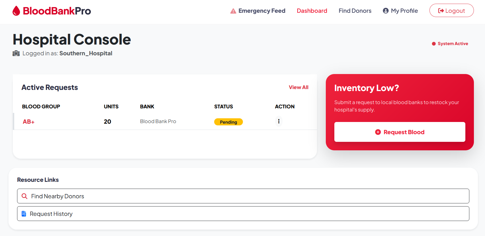
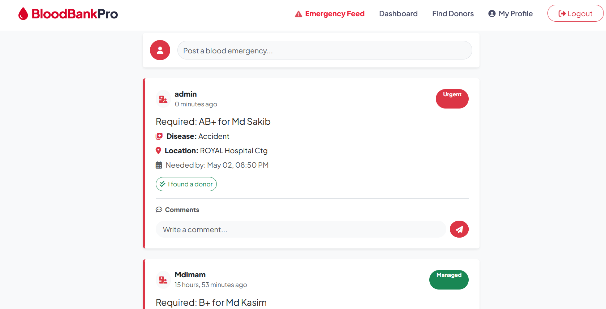

🩸 Blood Bank Management System

A comprehensive, data-driven web application built with Django to manage blood donations, hospital requests, and real-time inventory tracking. This system automates the communication loop between donors, hospitals, and administrators to save lives more efficiently.
🚀 Live Demo

Website: https://complete-blood-bank.onrender.com/

(Note: It may take 30–60 seconds to load initially due to Render's free-tier "spinning up" process.)

📸 App Preview
## 📸 App Preview

### Landing Page

![Home] (screenshots/landing_page_03.png)

### Login

### Register

### Admin Dashboard & Inventory Analytics

### User Portals

### Hospital Portals

### Find Donor

### Emergency Feed

Seamless interfaces for Donors and Hospitals.
✨ Key Features
👤 User Roles & Functionality

    Donors: Register a profile, apply for blood donation, and view a personal history of all past donations.

    Hospitals: Secure login to request specific blood units and track the approval status of orders.

    Administrators: Centralized control panel to approve/reject requests, manage blood stock levels, and oversee all users.

🛠 Technical Highlights

    Automated Inventory: Stock levels automatically increase upon donation approval and decrease upon hospital request fulfillment.

    Email Confirmations: Integrated Gmail SMTP sends automatic confirmation emails to users once their requests are processed by an admin.

    Data Visualization: A dynamic bar chart on the admin dashboard provides an instant overview of available blood units by group.

    PDF Report Generation: Admins can generate and download comprehensive transaction reports in PDF format using ReportLab.

    Responsive UI: Styled with Bootstrap 5 and Django Crispy Forms for a clean look on both mobile and desktop.

🛠 Tech Stack

    Backend: Django 6.0

    Database: PostgreSQL (Live) / SQLite (Local)

    Frontend: HTML5, CSS3, Bootstrap 5, Chart.js

    Deployment: Render

    Email: Gmail SMTP (with App Passwords)

💻 Local Installation

    1. Clone the Repo: 
        git clone https://github.com/your-username/blood-bank-complete.git
        cd blood-bank-
    2. Setup Virtual Environment:
       python -m venv venv
       source venv/bin/activate  # Windows: venv\Scripts\activate   
    3. Install Dependencies:
       pip install -r requirements.txt
    4. Environment Variables:
       Create a .env file in the root directory:
       SECRET_KEY=your_django_secret_key
       EMAIL_HOST_USER=your-email@gmail.com
       EMAIL_HOST_PASSWORD=your-16-digit-app-password
       DEBUG=True 
    5. Initialize Database:
       python manage.py migrate
       python manage.py runserver    

🧪 Admin Test Credentials

If you are evaluating the administrative features, you may use the following demo account:

    URL: /admin

    Username: admin

    Password: YourSecurePassword123

⚠️ Deployment & Maintenance Notes

    Database Persistence: This project uses Render PostgreSQL. Please note that on Render's free tier, databases are deleted after 30 days.

    Static Files: Served via WhiteNoise for high performance in production.

    Security: DEBUG mode is disabled in production, and sensitive keys are managed via environment variables.

📄 License

This project is open-source and available under the MIT License.

Developed with ❤️ by MD IMAM UL HOQUE SABBIR             
    